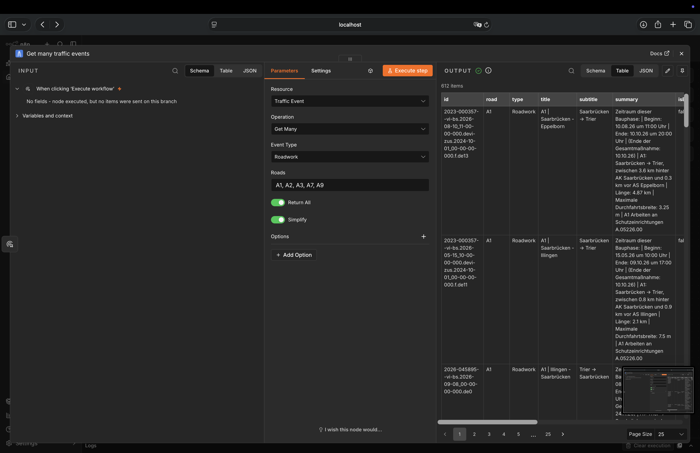
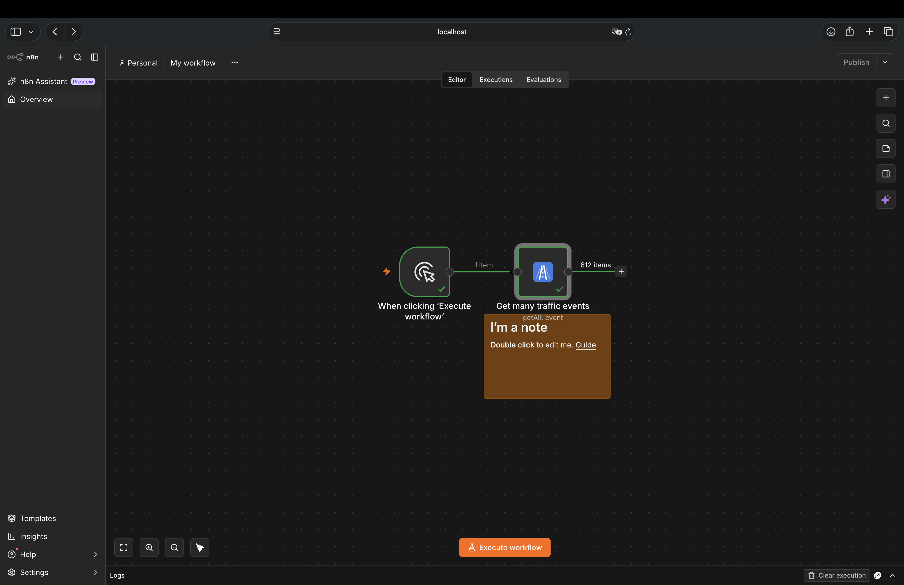
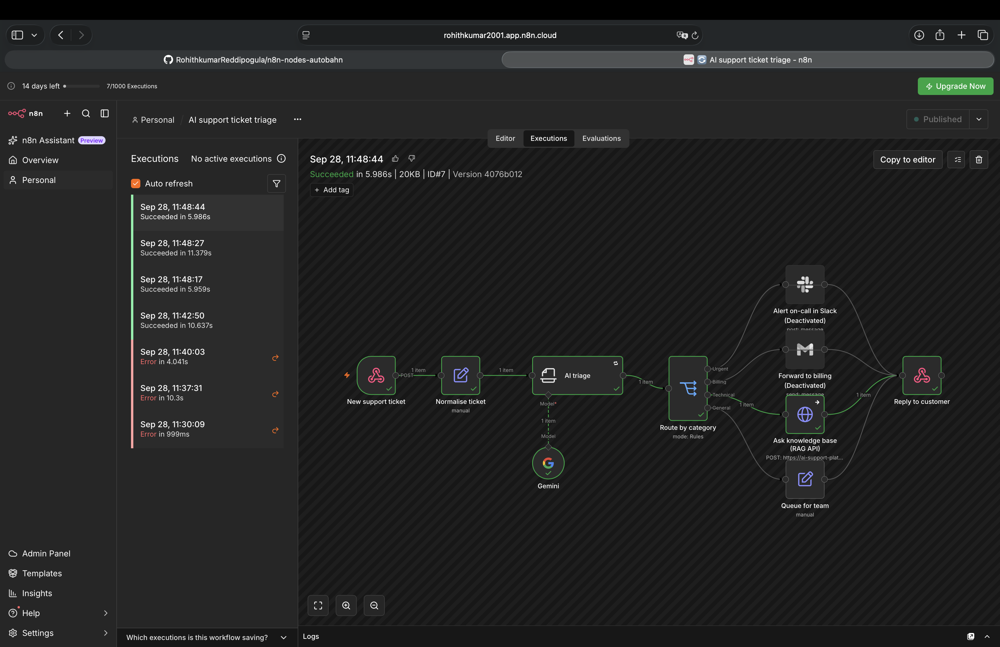
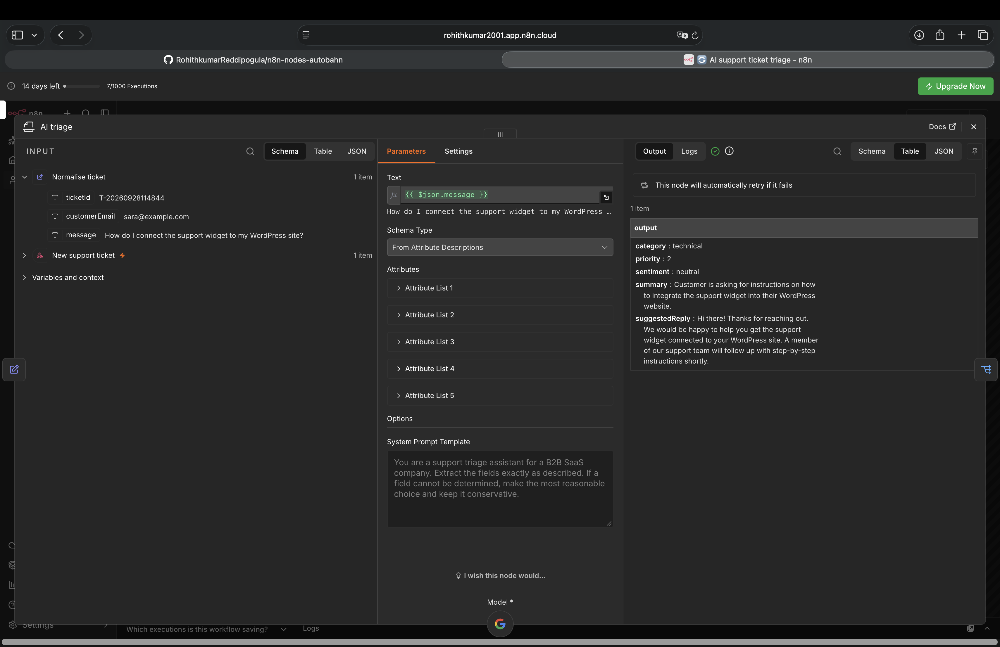

# n8n-nodes-autobahn

A community node for [n8n](https://n8n.io) that brings live German Autobahn data into your workflows: roadworks, warnings, closures, EV charging stations, lorry parking and traffic webcams.

It uses the official public API of Die Autobahn GmbH des Bundes (verkehr.autobahn.de). No API key or account is needed.



*The node in n8n, returning 612 live roadworks across the A1, A2, A3, A7 and A9 in a single request.*

## Contents

1. Why I built this
2. What it can do
3. Installation
4. Quick start
5. Output
6. Using it with AI agents
7. Example workflow
8. Development
9. Tested with
10. Related work
11. Credits and license

## 1. Why I built this

I first worked with the Autobahn API while building [BauWatcher](https://github.com/RohithkumarReddipogula/bauwatcher), a live map of roadworks in Germany. The data is great, but it is not pleasant to work with. Every road has to be requested separately, true and false come back as strings, coordinates are strings, descriptions are arrays of loose German text lines, and each event type lives under a different key.

When I wanted the same data inside n8n, I did not want to rebuild that clean-up logic with HTTP Request and Code nodes in every workflow. So I packaged it once as a node. You choose an event type and a list of roads, and you get back clean, typed items that work directly in an IF node, a Google Sheet, a Slack message or an LLM prompt.

## 2. What it can do

| Resource      | Operation | Description                                               |
|---------------|-----------|-----------------------------------------------------------|
| Road          | Get Many  | List every Autobahn the API covers (A1, A2 ... A999)      |
| Traffic Event | Get Many  | Get all events of one type on one or more roads           |
| Traffic Event | Get       | Get the full details of a single event by its ID          |

Supported event types: Roadwork, Warning, Closure, Charging Station, Lorry Parking and Webcam.

Options:

| Option                | Default | What it does                                                    |
|-----------------------|---------|-----------------------------------------------------------------|
| Roads                 | A100    | Comma-separated list. Input is forgiving, so "a 9, A100" works  |
| Return All            | on      | Return every match, or stop at the limit below                  |
| Limit                 | 50      | Maximum number of events when Return All is off                 |
| Simplify              | on      | Clean, flat fields instead of the raw API response              |
| Only Blocked          | off     | Keep only events where lanes or the road are blocked            |
| Exclude Future Events | on      | Skip events that have not started yet                           |

## 3. Installation

The package is not on npm yet, so for now it is installed from source on a self-hosted n8n.

```bash
git clone https://github.com/RohithkumarReddipogula/n8n-nodes-autobahn.git
cd n8n-nodes-autobahn
npm install
npm run build

mkdir -p ~/.n8n/nodes/node_modules/n8n-nodes-autobahn
cp -r package.json dist ~/.n8n/nodes/node_modules/n8n-nodes-autobahn/
```

Restart n8n and search for "Autobahn" in the nodes panel.

Note: n8n Cloud only allows verified community nodes, so this node currently needs a self-hosted n8n.

## 4. Quick start

1. Add a Manual Trigger.
2. Add the Autobahn node and choose Traffic Event > Get Many.
3. Set Event Type to Roadwork and Roads to `A1, A2, A3`.
4. Click Execute step.



## 5. Output

With Simplify on (the default), every event comes back in the same shape:

```json
{
  "id": "2026-049200--vi-bs.2026-09-28_09-00-00-000...",
  "road": "A1",
  "type": "Roadwork",
  "title": "A1 | Hermeskeil - Hochwald-Ost",
  "subtitle": "Saarbruecken -> Trier",
  "summary": "28.09.26 von 09:00 bis 18:00 Uhr | Laenge: 2.97 km | Max. 80 km/h | Markierungsarbeiten",
  "isBlocked": false,
  "isFuture": false,
  "startTime": null,
  "latitude": 49.658,
  "longitude": 6.923,
  "mapUrl": "https://www.openstreetmap.org/?mlat=49.658&mlon=6.923#map=14/49.658/6.923"
}
```

Turn Simplify off if you need the full raw record. The node then returns the API object as it is, with a `road` field added.

## 6. Using it with AI agents

The node can be used as a tool by the n8n AI Agent node. Attach it to an agent and it can answer questions like "Are there any closures on the A9 right now?" or "Where can a truck park on the A2?" by calling the API itself.

Keep Simplify on in this setup. The flat output is much shorter than the raw response, which saves tokens and gives the model less to get confused by.

## 7. Example workflow

`examples/autobahn-daily-briefing.json` is a ready-to-import workflow. Every weekday at 07:00 it fetches blocked roadworks and closures on a list of Berlin roads, asks an LLM (Gemini) to write a short commuter briefing, and emails it.

Import it with Workflows > Import from File, then add your own Gemini and Gmail credentials.

## 8. Development

Requires Node.js 20 or later.

```bash
npm install
npm run build     # compile TypeScript into dist/
npm run lint      # official n8n community node linter
npm test          # build and run the unit tests
npm run dev       # start a local n8n with the node loaded
```

The tests mock the HTTP layer with fixtures in the same shape as the real API, so they run offline and in CI. They cover road listing, requests across several roads, the filters, limits, raw and simplified output, single-event lookup, empty results, validation errors and Continue On Fail. GitHub Actions runs lint, build and tests on every push.

## 9. Tested with

- n8n 2.40.7 (self-hosted), with live data from the Autobahn API
- n8n-workflow 2.x, @n8n/node-cli 0.49
- Official n8n node linter: no errors

## 10. Related work

I also built an AI support ticket triage workflow in n8n. A webhook receives a ticket, Gemini extracts the category, priority, sentiment and a draft reply, and a Switch node routes it to Slack, email, a knowledge base API or a queue. It retries when the model is overloaded and falls back to the drafted reply if the knowledge base is down. Here it classifies an account lockout as urgent, priority 5:





## 11. Credits and license

Data: Die Autobahn GmbH des Bundes, via the public API documented at [autobahn.api.bund.dev](https://autobahn.api.bund.dev/).

Built by [Rohith Kumar Reddipogula](https://rohithkumarreddipogula.github.io). Feedback and issues are welcome.

MIT License
